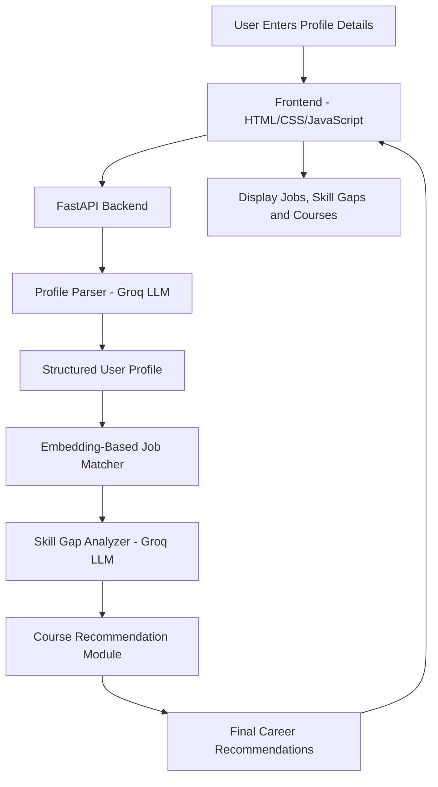

# SkillBridge AI Architecture



## Technologies Used

- Frontend: HTML, CSS, JavaScript
- Backend: FastAPI
- AI Model: Groq LLM
- Job Matching: Sentence Transformers
- Workflow: LangGraph
- Data Validation: Pydantic
- Version Control: GitHub
```s